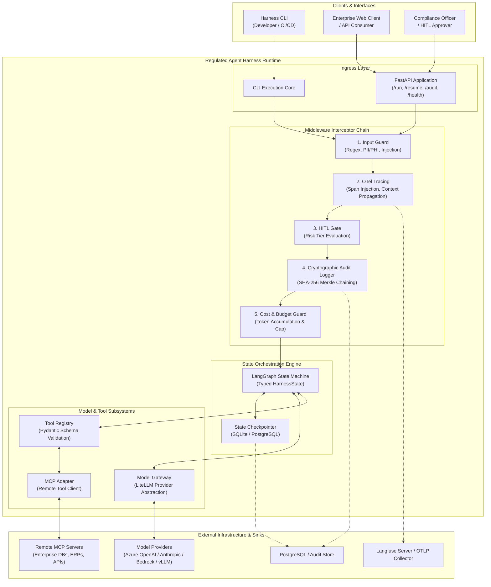
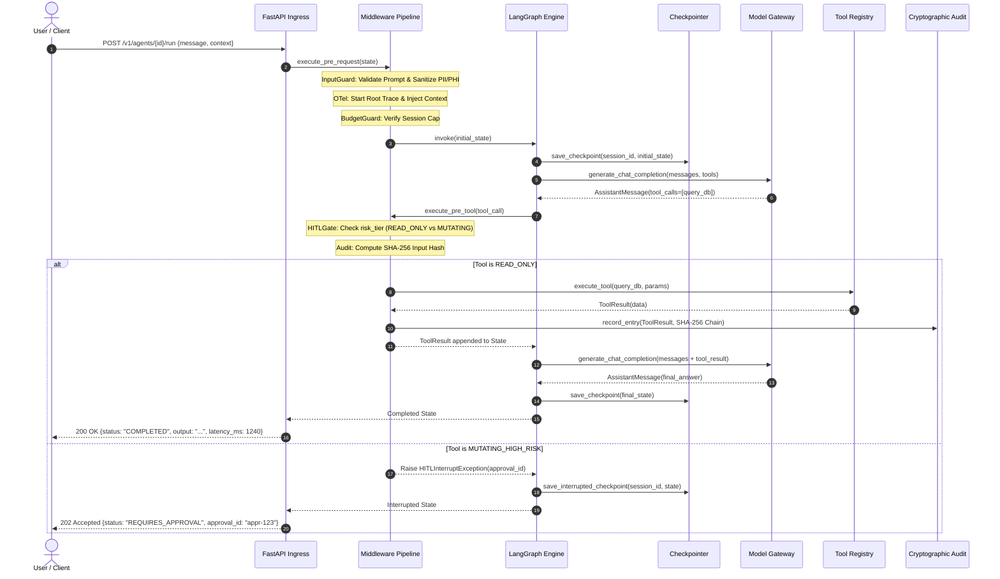
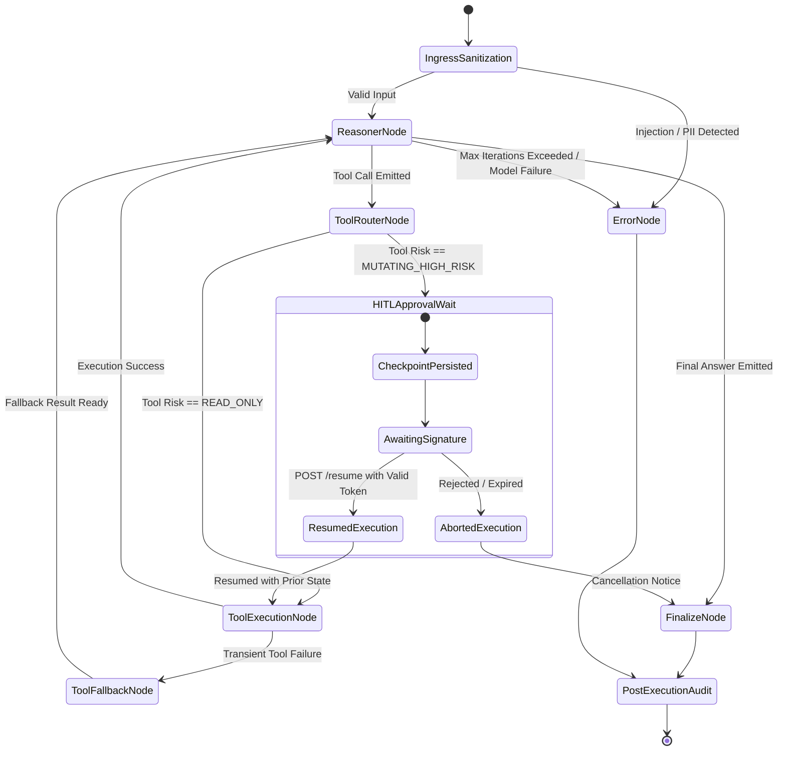
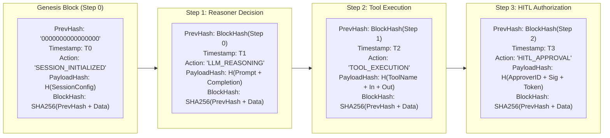

# System Architecture: Regulated Agent Harness

**Document Version:** 1.0.0  
**Status:** Approved  
**Classification:** Core System Architecture Specification  
**Compliance Standards:** FDA 21 CFR Part 11, GxP, ISO 27001, SOC2 Type II  

---

## 1. Architectural Overview & Design Philosophy

The **Regulated Agent Harness** is engineered to eliminate the fundamental vulnerabilities of autonomous agent architectures when deployed in regulated enterprise environments: non-determinism, lack of observability, unconstrained token budgets, and missing auditability.

### Core Architectural Principles:
1. **Deterministic State-Graph Over Wild Autonomy:** Agent decision-making is constrained to a finite-state machine with well-defined transitions, explicit fallback boundaries, and cycle limits.
2. **Synchronous Guarding, Asynchronous Offloading:** Security, compliance, and schema validations execute synchronously in the critical path with strict latency bounds (<40ms overhead). Heavy observability and persistence offload asynchronously.
3. **Defense-in-Depth Middleware Chain:** Every state transition and tool execution passes through an extensible interceptor pipeline enforcing input hygiene, distributed tracing, budget caps, human authorization, and tamper-evident logging.
4. **Zero Vendor Lock-In:** Core models and remote tools are abstracted through unified protocols (LiteLLM and Anthropic Model Context Protocol), allowing infrastructure swaps with zero codebase modification.

---

## 2. High-Level & Low-Level System Topology

### 2.1 System Context Diagram

---

## 3. End-to-End Data Flow

The following sequence details an end-to-end request lifecycle, tracing a user prompt from ingress, through the middleware chain, state graph iteration, model invocation, tool execution, and synchronous response delivery.

---

## 4. State-Machine Lifecycle & HITL Resumption

The core orchestration engine is modeled as a formal LangGraph state machine. It prevents indefinite execution loops, isolates transient failures, and manages human intervention seamlessly.

### Deterministic State Transitions
1. **Reasoner Node (`reasoner`):** Prompts the model gateway with current conversation history, tool definitions, and system prompts.
2. **Tool Router Node (`tool_router`):** Inspects model output. If a tool call is requested, routes based on the tool's registered risk tier (`READ_ONLY` vs `MUTATING_HIGH_RISK`).
3. **HITL Interrupt Gate (`hitl_gate`):** For mutating tools, triggers LangGraph's native `interrupt()`, generating an immutable `approval_id` and saving state snapshot to the persistent checkpointer.
4. **Tool Execution Node (`tool_executor`):** Executes validated tool functions or delegates to remote MCP servers with strict execution timeouts.
5. **Fallback Node (`error_fallback`):** When a tool fails or throws an exception, captures the error, crafts a structured error tool response, and feeds it back to the reasoner rather than crashing the graph.
6. **Finalize Node (`finalizer`):** Formats final user output, computes session summary statistics (tokens, costs, latency), and marks session completed.

---

## 5. Cryptographic Audit Trail Architecture (FDA 21 CFR Part 11)

In regulated enterprise environments, audit records must be computer-generated, immutable, timestamped, and tamper-evident. The harness enforces this via an **Append-Only SHA-256 Merkle Hash Chain**.

### 5.1 Merkle Hash Chaining Topology

### 5.2 Mathematical Formulation of Hash Chain

For any audit step $k \in \{0, 1, 2, \dots, n\}$:
- For $k = 0$ (Genesis):
  $$\text{PrevHash}_0 = 0^{64} = \text{"0000000000000000000000000000000000000000000000000000000000000000"}$$
- For $k > 0$:
  $$\text{PrevHash}_k = \text{BlockHash}_{k-1}$$
- The Payload Digest is computed over canonical, sorted JSON:
  $$\text{PayloadHash}_k = \text{SHA256}(\text{Canonicalize}(\text{StepData}_k))$$
- The Block Hash incorporates the previous hash, sequence index, UTC timestamp, actor, action, and payload hash:
  $$\text{BlockHash}_k = \text{SHA256}(\text{PrevHash}_k \parallel k \parallel \text{Timestamp}_k \parallel \text{Actor}_k \parallel \text{Action}_k \parallel \text{PayloadHash}_k)$$

### 5.3 Tamper Verification Guarantee
If an adversary or unauthorized process modifies any field in `Step 1`:
1. $\text{PayloadHash}_1$ changes.
2. $\text{BlockHash}_1$ changes.
3. In `Step 2`, the recorded $\text{PrevHash}_2 \neq \text{BlockHash}_1$.
4. The audit validation algorithm iterates through the chain and immediately flags:
   $$\text{VerificationFailed}(\text{Step}=2, \text{Reason}="HashMismatch")$$

---

## 6. Architecture Decision Records (ADRs)

### ADR-001: LangGraph vs. Autonomous ReAct Loops for Regulated Enterprise Agents

* **Status:** Accepted  
* **Date:** 2026-10-06  
* **Context:**  
  Enterprise multi-agent systems require predictable execution, strict loop termination, state persistence across process restarts, and human-in-the-loop pause/resume capabilities. Naive ReAct implementations (such as unbounded while-loops in vanilla LangChain or custom scripts) lack formal state machine validation, making it difficult to guarantee compliance with FDA GxP and ISO 27001 operational risk requirements.
* **Decision:**  
  Adopt **LangGraph (>=0.2.x)** as the sole state orchestration engine. All agent logic must be structured as explicit directed cyclic graphs with typed Pydantic state nodes.
* **Consequences:**  
  - *Positive:* Native checkpointing into SQLite or PostgreSQL; deterministic human-in-the-loop `interrupt()` semantics; formal visualization of graph topologies; explicit edge conditions preventing infinite runaway execution.
  - *Negative:* Slight learning curve for FDE teams accustomed to single-file script prototyping; requires rigorous state schema typing.

---

### ADR-002: Tamper-Evident Audit Logging Conforming to FDA 21 CFR Part 11

* **Status:** Accepted  
* **Date:** 2026-10-06  
* **Context:**  
  Under FDA 21 CFR Part 11 (Section 11.10(e)), computer systems must employ secure, computer-generated, time-stamped audit trails to independently record the date and time of operator entries and actions that create, modify, or delete electronic records. Traditional centralized log aggregators (e.g., Datadog, CloudWatch) are mutable by system administrators and do not provide mathematical proof that a log sequence was not altered retroactively.
* **Decision:**  
  Implement a **cryptographic SHA-256 Merkle hash chain** directly within `harness.compliance.audit`. Every state step, LLM interaction, tool invocation, and human approval generates an immutable `AuditRecord` whose `block_hash` incorporates the previous entry's `block_hash`. Records are stored in an append-only JSONL / database table with a dedicated programmatic validation endpoint (`/v1/agents/{id}/audit/verify`).
* **Consequences:**  
  - *Positive:* Full mathematical tamper detection; compliance officers can independently verify log integrity; satisfies strict regulatory audits.
  - *Negative:* SHA-256 computation adds minor overhead (benchmarked at ~0.8ms per record using Python's C-accelerated `hashlib`, well within the <40ms SLA).

---

### ADR-003: HITL State Interruption and Deterministic Resumption Mechanics

* **Status:** Accepted  
* **Date:** 2026-10-06  
* **Context:**  
  In enterprise operations, AI agents must not autonomously execute high-consequence operations (e.g., executing a financial transaction, modifying clinical dosage guidelines, or quarantining physical pharmaceutical batches). The system must halt, solicit human authorization, and resume without repeating previously completed reasoning or tool executions.
* **Decision:**  
  Implement a dynamic risk classification layer where tools are categorized as `READ_ONLY` or `MUTATING_HIGH_RISK`. When a `MUTATING_HIGH_RISK` tool call is generated:
  1. The orchestrator triggers LangGraph's native `interrupt()`.
  2. The state snapshot is persisted in the durable checkpointer with `status = "AWAITING_APPROVAL"`.
  3. A cryptographic approval token (`approval_id`) is emitted to the caller.
  4. Resumption is exposed via `POST /v1/agents/{id}/resume`, accepting the `approval_id`, approver credentials, and digital signature.
  5. The checkpointer restores state exactly at the interrupted node and executes the tool without re-invoking prior nodes.
* **Consequences:**  
  - *Positive:* Absolute safety guarantee for mutating operations; zero duplication of side effects; audit trail records the human identity and cryptographic token.
  - *Negative:* State checkpointers must be durable across server restarts (SQLite in dev, PostgreSQL in production).

---

## 7. Performance & Latency Budgets (<40ms SLA)

To ensure the harness remains low-overhead and does not introduce perceptible latency to agent interactions, the middleware interceptor chain is subjected to a strict **40ms latency budget** per step:

| Interceptor Phase | Maximum Allowed Latency | Target Mechanism |
|---|---|---|
| **Input Guard (Pre-execution)** | 5.0 ms | Pre-compiled regex patterns, vectorized keyword lookup |
| **OTel Tracing (Context Injection)** | 2.0 ms | In-memory span creation, background OTLP export thread |
| **HITL Risk Evaluation** | 1.0 ms | In-memory set lookup against tool metadata registry |
| **Cryptographic Hash Computation** | 3.0 ms | Canonical JSON serialization + C-accelerated `hashlib.sha256` |
| **Pydantic Schema Validation** | 4.0 ms | Pydantic v2 Rust core validation engine |
| **State Checkpointing (SQLite/Postgres)** | 20.0 ms | Async write with connection pooling (`asyncpg`/`aiosqlite`) |
| **Buffer Margin** | 5.0 ms | Safety cushion for system scheduling jitter |
| **Total Interceptor Overhead** | **< 40.0 ms** | **Guaranteed SLA** |
